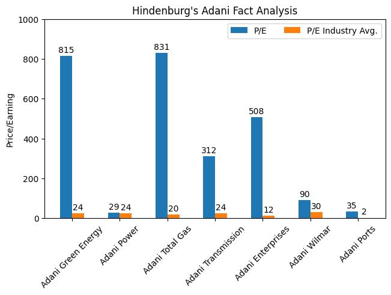

# Introduction
To learn and understand visualisation, it's benefits and how to create visualisations using `matplotlib`.

The tables are taken from Hindenburg Research's [Adani Group: How The World’s 3rd Richest Man Is Pulling The Largest Con In Corporate History](https://hindenburgresearch.com/adani/) articles.

The idea is to better understand the stats provided through visualisation.

## Challenges
1. The tables are provided as an image, needs conversion to a text based format.
2. Never done much visualisation before, but I believe visuals are more powerful tools that tables help us humans understand data better.
3. Not much of a statistian, but statistics and probablity are powerful techniques to identify patterns esp., when the data is dense or vast.

## Approach
Read through the article, and plot the tables, all the while trying to understand what sort plot/chart works best for that table.

## Types of plots
1. Comparison
2. Distribution
3. Composition

### Comparison
When the data is a trying to do a comparison. (obviously! But what does that mean?)
And example would be say we want to compare the all year weather of 2 cities. Maybe that will help us plan vacations!

Some charts are useful to depict `comparsions` like `bar plot` or `scatter plot`.

#### Grouped Bar Plot
Plotting two or more column values for multiple rows.

Example :-

**We can use the table below**

| Name | Price/Earnings | Industry Avg. (P/E) | Implied Downside (P/E) |
|---|---|---|---|
| Adani Green Energy | 815x | 24x | -97.10% |
| Adani Power | 29x | 24x | -18.17% | 3.9x |
| Adani Total Gas | 831x | 20x | -97.64% |
| Adani Transmission | 312x | 24x | -92.43% |
| Adani Enterprises | 508x | 12x | -97.68% |
| Adani Wilmar | 90x | 30x | -67.12% |
| Adani Ports | 35x | 2x | -93.26% |

**to create a plot like :-**

### Distribution

### Composition

## Further Reading
1. [Matplotlib Tutorials](https://matplotlib.org/stable/tutorials/index.html)
2. [Matplotlib Examples](https://matplotlib.org/stable/gallery/index.html)
3. [Pandas](https://pandas.pydata.org/docs/user_guide/10min.html)
4. [Numpy](https://numpy.org/)

